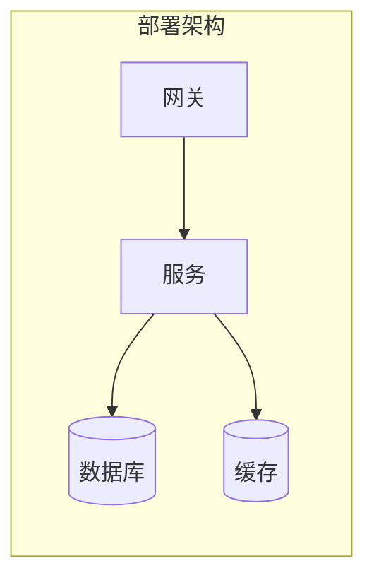

# ✅ 部署验证报告: C-NNN

## 环境
- profile: dev / 镜像: …

## 部署拓扑（Mermaid）

## 健康检查
- [x] 健康检查端点 = UP

## 冒烟测试
| 链路 | 结果 |
|------|------|
| 主链路 | 🟢 |
| 降级链路 | 🟢 |

## 可观测性
- [x] trace 完整 / 指标上报 / 日志合规

## 回滚预案
- 上一稳定版本: <tag>
- 回滚命令: <cmd>
- 触发条件: <…>

## 结论
✅ 验证通过，变更可交付 / ❌ 失败，退回 …