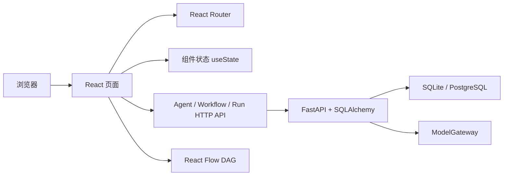

# ARC.ONE 当前版本实现说明

> 对应版本：V0.8D Trace ID 与运行链路骨架
> 更新时间：2026-06-27

## 1. 当前版本是什么

当前版本是 React 单页应用与 FastAPI 服务组成的可运行原型。

Agent 资产页和工作流设计器已经接入 SQLAlchemy。Agent 支持草稿编辑、版本发布、停用和测试运行；工作流支持草稿持久化、DAG 校验、Agent 版本引用、不可变发布和按拓扑顺序运行。

运行实例、节点运行、不可变产出物版本和正式 Human Task 已持久化。工作流在 Human 节点暂停，能够经过认领、会签、人工决策后继续、重跑或终止。人工修改会保存 Diff 并形成反馈候选，专家确认后可沉淀为 Golden Sample。

运行中心与人工审核工作台已切换到真实 API。模型调用通过可注入的 OpenAI-compatible ModelGateway 完成；自动化测试使用 FakeGateway，不依赖外部网络。

当前已使用 DeepSeek OpenAI-compatible API 完成真实成功调用验证：Base URL 为 `https://api.deepseek.com`，模型为 `deepseek-v4-pro`。真实 API Key 仅保存在被 Git 忽略的本地 `apps/api/.env` 中。模型单价环境变量尚未配置，因此运行中心的成本暂显示为 `$0.000000`，Token 统计不受影响。

API Key 不进入前端、数据库、仓库和运行响应。



Agent、工作流、运行记录、Human Task、审核决定、审计事件和反馈数据通过本机 `/api` 发送到 FastAPI，并保存到默认 SQLite 文件 `apps/api/data/arc_one.db`。刷新页面或重启 API 后会重新读取持久化记录。

## 2. 启动链路

### 2.1 HTML 入口

文件：`index.html`

作用：

- 定义中文页面语言。
- 设置移动端 viewport。
- 设置页面标题和描述。
- 挂载 `#root` 容器。
- 加载 `src/main.tsx`。

### 2.2 React 入口

文件：`src/main.tsx`

作用：

- 引入全局 CSS。
- 创建 React Root。
- 渲染根组件 `App`。
- 使用 `StrictMode` 帮助发现潜在副作用问题。

### 2.3 应用路由

文件：`src/App.tsx`

路由关系：

| URL | 页面组件 |
|---|---|
| `/` | `Dashboard` |
| `/workflows` | `Workflows` |
| `/agents` | `Agents` |
| `/evaluations` | `Evaluations` |
| `/runs` | `Runs` |
| `/reviews` | `Reviews` |
| `/observability` | `Observability` |

`Layout` 作为共同外壳，负责侧栏、顶部栏和页面内容区域。

## 3. 应用外壳

文件：`src/components/Layout.tsx`

实现内容：

- 左侧主导航。
- 当前路由高亮。
- 人工审核数量角标。
- Workspace 展示。
- 顶部页面名称。
- 全局搜索输入框外观。
- 通知按钮。
- 生产环境状态展示。
- 使用 React Router 的 `Outlet` 渲染当前页面。

当前限制：

- 全局搜索只有界面，没有搜索逻辑。
- 通知按钮没有通知中心。
- Workspace 不能切换。
- “生产环境”只是展示文本。

## 4. 数据模型

文件：`src/types.ts`

当前 TypeScript 接口覆盖：

### Agent

包含：

- 名称和角色。
- 负责人。
- 模型和版本。
- 在线状态。
- 质量通过率。
- 运行次数。
- 工具列表。

### Rubric

包含：

- 适用产出物。
- 评分维度。
- 维度权重。
- 硬性门禁。
- 自动通过分数。
- 版本。

### WorkflowRun

包含：

- 工作流名称。
- 运行状态。
- 进度。
- 启动时间和耗时。
- 得分和成本。
- 当前节点。

### HumanTask

包含：

- 任务状态、分配方式和审核策略。
- 所属运行、Human 节点与来源 Agent 节点。
- 审核人、审核组和参与人快照。
- 截止、升级时间与 SLA 状态。
- 当前产出物版本、会签进度和恢复状态。
- 审计事件、通知 Outbox、反馈候选和 Golden Sample。

这些接口目前由前端手工维护，后续需要由 `packages/contracts` 中的正式 Schema 或 OpenAPI 生成类型替代。

## 5. 演示数据

文件：`src/data/mock.ts`

当前文件仍提供历史演示数组：

- 5 个 Agent。
- 3 套 Rubric。
- 5 条运行实例。
- 3 条人工审核任务。
- 6 项运营指标。

Agent、工作流、运行中心和人工审核页面不再读取其中的 Agent、Run 与 Review 数组，已改用真实 FastAPI。评估中心和运营总览仍使用 Rubric 与运营指标演示数据。

## 6. 工作流 DAG

### 6.1 页面

文件：`src/pages/Workflows.tsx`

采用：

- `@xyflow/react`
- `useNodesState`
- `useEdgesState`
- `addEdge`
- `ReactFlow`
- `Background`
- `Controls`
- `MiniMap`

### 6.2 当前节点

新建工作流默认初始化 3 个已连线节点：

1. 手动触发。
2. 选择执行 Agent。
3. 流程完成。

左侧节点库可点击添加手动触发、Agent、工具调用、数据查询、条件分支、
质量门禁、人工审核、代码执行、等待节点和流程完成。窄屏下节点库改为
横向滚动，仍可访问全部节点类型。

### 6.3 自定义节点

文件：`src/components/WorkflowNode.tsx`

节点支持以下类型：

- Trigger。
- Agent。
- Tool。
- Data。
- Branch。
- Gate。
- Human。
- Code。
- Wait。
- End。

每种节点使用不同图标和状态颜色。节点左右使用 React Flow Handle 作为连接端点：
左侧空心点是输入，右侧实心点是输出。

### 6.4 已实现交互

- 节点拖动。
- 画布缩放和平移。
- 从上游节点右侧输出点拖到下游节点左侧输入点完成连线。
- 连线随草稿保存并在重新加载后恢复。
- 新建工作流恢复 3 个默认节点和 2 条默认连线。
- 小地图。
- 点击节点打开配置面板。
- 修改节点名称。
- Human 节点配置指定审核人、审核组、组内认领或轮询分配。
- 指定审核人只展示已授予且启用的 Reviewer 资格；未出现的成员需要先到成员与权限绑定 Reviewer 资格。
- Human 节点配置任一通过、全员通过和 N 人通过。
- Human 节点配置截止时间、升级时间和升级组。
- 发布前校验 Human 节点分配、会签人数和 SLA 参数。
- 保存提示。

### 6.5 尚未实现

- 从左侧节点库拖拽进入画布；当前为点击添加。
- 复制、框选和分组节点。
- 撤销和重做。
- 多选和分组。
- 输入输出变量连线。
- 完整节点参数 Schema 编辑器。
- 循环、并行汇聚和子流程。
- 失败后的断点恢复。
- 并行节点、汇聚和条件路由执行。

当前工作流数据链路：

```text
React Flow 节点/连线
→ 平台 Workflow Contract
→ FastAPI + SQLAlchemy 草稿
→ DAG 与 Agent 版本引用校验
→ WorkflowVersion 不可变快照
```

## 7. Agent 资产页

文件：`src/pages/Agents.tsx`

实现：

- 展示 Agent 状态、模型、版本和负责人。
- 展示质量通过率和运行次数。
- 展示工具标签。
- 使用 `useState` 保存搜索词。
- 使用 `useMemo` 过滤 Agent。
- 通过 `GET /api/agents` 加载持久化 Agent。
- 通过弹窗填写名称、职责、负责人和模型。
- 提交前显示字段级校验错误。
- 通过 `POST /api/agents` 创建 Agent。
- 显示加载、空数据、重试和服务端错误状态。
- 创建成功后立即更新列表，刷新后重新读取数据库。
- 每条 Agent 显示明确的“编辑与发布”入口，点击 Agent 名称也可进入详情页。
- 编辑名称、职责、负责人、模型和 System Prompt。
- 配置 Tools 与 Skills。
- 发布不可变 AgentVersion。
- 查看版本历史。
- 停用 Agent，并阻止继续编辑或发布。
- 运行已发布 Agent 版本。
- 展示运行状态、产出、Token、得分和耗时。

未实现：

- 模型参数。
- Tool/Skill 的独立资产库和权限契约。
- Agent 版本比较和回滚。
- 聚合后的真实运行统计。

## 8. 评估中心

文件：`src/pages/Evaluations.tsx`

实现：

- 从 FastAPI 读取 Workspace 级评估资产概览。
- 展示反馈候选、待确认候选、已确认候选、Golden Sample、覆盖工作流和覆盖 Agent。
- 展示最近反馈候选的状态、原因和标签。
- 无候选数据时展示空状态。
- Rubric 卡片。
- 评分维度和权重。
- 硬性门禁。
- 自动流转阈值。

后端 API：

```text
GET /api/workspaces/{workspace_id}/evaluations/overview
```

未实现：

- Rubric 编辑器。
- 评价器执行。
- LLM-as-a-Judge。
- Golden Set 管理。
- 回归测试任务。
- 评价一致性校准。

## 9. 运行中心

文件：`src/pages/Runs.tsx`

实现：

- 运行实例列表。
- 点击切换当前实例。
- 状态和进度。
- 总耗时、得分和成本。
- 节点执行时间线。
- 最终产出、模型、Token 和节点重试次数。
- 从 FastAPI 读取持久化 Run 与 NodeRun。

运行实例选择逻辑：

```text
点击运行实例
→ setSelectedId
→ 从 API 返回的 Run 列表寻找对应对象
→ 右侧详情重新渲染
```

未实现：

- WebSocket/SSE 实时推送。
- 日志查询。
- 真实暂停、终止和重跑。
- Trace。
- 运行回放。

## 9A. 运行观测

文件：`src/pages/Observability.tsx`

实现：

- Workspace 级运行概览。
- 总运行、失败运行、人工介入、恢复失败、平均耗时、Token 和成本摘要。
- 风险优先列表，优先展示失败、等待人工处理和恢复失败运行。
- 最近运行列表。
- 点击运行后加载节点级排障详情。
- 支持运行状态、工作流名称和风险等级筛选。
- 筛选条件与当前运行通过 URL query 同步，便于刷新保留和分享排障视图。
- 运行详情展示 `Trace ID`，节点执行链路展示 `Span` 与父 `Span`。
- 旧运行数据在读取观测详情时会懒回填轻量 Trace/Span 字段。
- 审计事件会挂到同一 Trace，并尽量关联到对应 Human Task 节点 Span。
- 详情展示当前处理建议、输入/结果、节点执行链路、人工审核任务和审计事件。
- 无运行数据时提示先发布并运行工作流。
- 状态文案通过 `displayStatus` 规整历史乱码状态。
- 人工 SLA 运营区块展示活跃任务、待认领、审核中、即将到期、已逾期、已升级和恢复失败。
- 支持按 Reviewer 和审核组过滤 Human Task SLA 风险。
- SLA 风险项可跳转到人工审核页，并携带 `taskId` 查询参数。
- 成本与模型调用区块展示运行次数、总 Token、Prompt Token、Completion Token 和累计成本。
- 支持按工作流和模型聚合 Token 与成本。
- 模型单价未配置时明确提示“成本单价未配置”，不把 `$0.0000` 伪装成真实成本。

后端 API：

```text
GET /api/workspaces/{workspace_id}/observability/overview
GET /api/workspaces/{workspace_id}/observability/runs/{run_id}
GET /api/workspaces/{workspace_id}/observability/human-sla
GET /api/workspaces/{workspace_id}/observability/cost-usage
```

未实现：

- 外部观测栈接入。
- 跨服务分布式 Trace 采集。
- 主动告警通知。
- 预算审批、成本告警和成本治理详情页。

## 10. 成员与权限

文件：`src/pages/Members.tsx`

实现：

- 展示 Workspace 成员、平台角色、User 状态、Membership 状态和最近登录时间。
- 支持邀请成员、重发邀请、撤销邀请和复制一次性激活链接。
- 支持更新成员平台角色、停用/启用 Membership、停用/启用 User。
- 支持为成员保存或撤销 Reviewer 资格。
- 页面顶部提供当前账号 Reviewer 快捷绑定入口，便于验收人工审核闭环。
- Reviewer 资格更新后会广播刷新事件，人工审核页可同步更新当前账号资格。

未实现：

- 企业通讯录同步。
- 角色批量管理。
- 成员搜索、分页和审计导出。

## 11. 人工协作与反馈闭环

文件：`src/pages/Reviews.tsx`

实现：

- 三栏审核工作台：队列、产出物操作区、任务上下文与时间线。
- 按状态、审核人、审核组和 SLA 查询或筛选任务。
- 查询本地 Reviewer 与 ReviewGroup 目录。
- 指定审核人、组内认领、轮询分配和任务转交。
- 任一通过、全员通过和 N 人通过三种会签策略。
- 通过、驳回、修改后通过和退回重跑四种决定。
- 审核原因必填、重复决定冲突和终态保护。
- Human 节点暂停 Workflow Run，决定完成后幂等恢复、重跑或终止。
- 修改后通过创建不可变 ArtifactVersion 和统一 Diff。
- 可单独重试失败的恢复请求。
- SLA 正常、即将到期、已逾期和已升级状态。
- 到期提醒、升级通知写入 NotificationOutbox，不发送外部消息。
- 完整审计时间线。
- 人工修改生成 FeedbackCandidate，专家可确认唯一 Golden Sample。
- 导航角标显示未终结 Human Task 数量。
- 移动端使用分段视图切换队列、审核和上下文。
- 有 Human Task 时，审核区展示当前任务权限，解释按钮可用或禁用的原因。
- V0.7B 首个切片增加审核概览：待处理任务、我的参与范围、SLA 风险和待确认反馈。
- 无 Human Task 时，页面解释任务来自工作流 Human 节点，并提供进入工作流编排和成员与权限的入口。
- 无 Human Task 时，页面提供 3 步验收路径：配置 Human 节点并发布、运行至需介入、回到人工审核提交决定。
- 无 Human Task 时，页面展示验收诊断：当前账号、Reviewer 资格、人工任务数量、最近运行状态和下一步建议。
- 队列状态筛选覆盖待认领、审核中、恢复失败、已通过、修改后通过、已驳回和已退回。
- 历史 SLA 乱码状态在队列、筛选和详情区会规整显示为正常、即将到期、已逾期或已升级。
- 新产生的 SLA 状态由后端写入正常中文，不再继续产生历史乱码。
- 筛选无结果时显示可操作提示，并支持一键清空筛选。
- 工作流运行返回“需介入”时，运行弹窗提示工作流已暂停在人工审核节点，并提供进入人工审核和运行中心的入口。
- 运行中心展示“需介入”运行时，提示等待人工审核，并提供进入人工审核的入口。
- 人工审核页支持 `/reviews?taskId=...` 深链，来自运行观测的任务链接会自动选中对应 Human Task。

未实现：

- 登录、真实用户身份和完整 RBAC。
- 与企业通讯录同步 Reviewer/ReviewGroup。
- 后台 SLA 定时扫描；V0.6 在读取和操作任务时刷新 SLA。
- 飞书等外部提醒发送；V0.6 仅持久化 Outbox。
- Golden Sample 的评估集管理、回归执行和自动训练流水线。
- JSON 字段级可视化 Diff；当前工作台以统一文本 Diff 为主。
- 人工审核页面不会创建演示任务；正式 Human Task 仍由工作流运行到 Human 节点时产生。

## 12. 运营总览

文件：`src/pages/Dashboard.tsx`

实现：

- 六项运营指标。
- 自动完成率柱状图。
- 异常和人工任务摘要。
- 最近运行表格。

柱状图是 CSS 高度图，不是图表库生成。

后续建议改用 Apache ECharts，并从运营指标 API 读取数据。

## 13. 样式系统

文件：`src/index.css`

当前采用单文件原生 CSS，包含：

- 颜色变量。
- 字体变量。
- 布局。
- 导航。
- 表格。
- 卡片和面板。
- 状态徽标。
- React Flow 节点。
- 移动端媒体查询。

当前设计方向：

- 平衡触感 Soft UI。
- 雾蓝灰同材质背景。
- 浅色悬浮图标导航。
- 面板使用克制的外凸阴影。
- 输入框、选中导航和按下状态使用内凹阴影。
- 雾蓝表示主操作、选中和运行状态。
- 珊瑚表示人工介入、风险和失败。
- 表格保留高信息密度和轻分隔线。
- 工作流节点采用统一纯材质，不使用类型色边。

当前 CSS 适合原型。进入多人开发后建议拆成：

```text
styles/
├─ tokens.css
├─ reset.css
├─ layout.css
└─ components/
```

也可以引入 CSS Modules，但不建议为了技术统一直接重写现有样式。

## 14. 当前状态管理

没有引入 Redux、Zustand 或 TanStack Query。

当前只使用 React 内置状态：

- `useState`。
- `useMemo`。
- React Flow 的节点和边状态 Hook。

这是有意为原型控制复杂度。

进入后端阶段后建议：

```text
服务器数据：TanStack Query
画布编辑状态：Zustand
表单状态：React Hook Form
Schema 校验：Zod
```

## 15. 当前构建和质量检查

### 开发

```powershell
npm run dev
```

### 静态检查

```powershell
npm run lint
```

使用 Oxlint。

### 生产构建

```powershell
npm run build
```

执行：

```text
TypeScript 编译检查
→ Vite 生产打包
```

当前自动化测试包括：

- Vitest + Testing Library：API 客户端、应用外壳、Agent、工作流配置、运行中心和人工审核工作台。
- Pytest：字段校验、Agent 生命周期、工作流 DAG、Human Task、分配会签、恢复执行、SLA、反馈候选和 Golden Sample。
- 浏览器验收：关键页面桌面端与移动端布局、真实 API 数据链路和控制台错误检查。

## 16. 当前依赖

生产依赖：

- React。
- React DOM。
- React Router DOM。
- React Flow。
- Lucide React。

开发依赖：

- TypeScript。
- Vite。
- Vite React 插件。
- React/Node 类型定义。
- Oxlint。

当前没有：

- UI 组件框架。
- 图表库。
- 第三方 HTTP 客户端，当前使用原生 `fetch`。
- 状态管理库。
- AI SDK。

后端新增：

- FastAPI。
- Pydantic。
- SQLAlchemy。
- SQLite，支持通过 `DATABASE_URL` 切换 PostgreSQL。

当前仍未引入后台任务队列和外部通知 SDK。

## 17. 当前版本验证记录

已经完成：

- `apps/api/.venv/Scripts/python.exe -m pytest apps/api/tests -q`：后端全量测试通过。
- `npm test -- --run`：25 个前端测试文件、71 项测试通过。
- `npm run lint`：Oxlint 通过。
- `npm run build`：TypeScript 编译与 Vite 生产构建通过。
- Human 节点发布前校验覆盖分配方式、会签人数和 SLA 参数。
- 旧 V0.5/V0.6 SQLite 表可增量补列，历史 Human Task 与 Review Decision 测试行保持可读。
- 真实 DeepSeek 调用生成 Artifact，Workflow Run 在 Human 节点进入等待审核。
- 桌面端完成认领、原因必填、修改后通过、Artifact v2、Diff、工作流恢复和审计时间线验证。
- 修改后通过生成 FeedbackCandidate，质量专家确认后创建唯一 Golden Sample。
- 移动端完成队列、审核、上下文分段切换和普通通过路径。
- 终态后导航 Human Task 角标无需刷新即可更新。
- `1440×900` 工作流编排和审核工作台无页面横向溢出。
- 移动端审核工作台无页面横向溢出，长产出物可读，底部决定按钮可操作。
- 工作流 Human 节点配置面板展示分配、审核组、会签、SLA 和升级组。
- 工作流新建后恢复 3 个默认节点和 2 条默认连线，新增节点后真实拖拽可创建第 3 条连线。
- `390×844` 下节点库横向滚动，手动触发和流程完成节点均可访问，页面无整体横向溢出。
- 浏览器验收期间控制台无 warning 或 error。
- V0.7B 人工审核页当前任务权限状态卡完成浏览器验收：无权限时展示“不能处理”、原因和下一步，并禁用认领与审核决定按钮。
- V0.7B 修复 Human 节点 `direct_reviewer` 与后端校验不一致的问题，指定审核人的参与快照可正确进入 Human Task 并完成认领。
- V0.8A 完成运行观测页浏览器验收：页面可打开，真实风险数据可渲染，风险状态规整为“等待审核”，浏览器日志无 error/warn。
- V0.8B 完成运行观测筛选测试：运行状态、工作流名称、风险等级可从 URL 初始化，筛选变更和选中运行会同步 URL query。
- V0.8D 完成 Trace 骨架测试：运行详情返回 Trace ID、节点 Span、父 Span 和审计事件 Span 关联，旧 SQLite 表可补列。
- V0.8A 完成人工 SLA 运营浏览器验收：SLA 区块、Reviewer/审核组筛选器和 `/reviews?taskId=...` 跳转链接可见，浏览器日志无 error/warn。
- V0.8C 完成成本与模型调用浏览器验收：区块、未配置单价提示、按工作流聚合和按模型聚合可见，浏览器日志无 error/warn。
- V0.9A 完成评估资产概览浏览器验收：真实 API 概览区块、空状态和 Rubric 卡片可见，浏览器日志无 error/warn。

验证时没有发现浏览器控制台错误。

当前机器未安装 Docker，因此 PostgreSQL Compose 配置与跨数据库正式迁移工具尚未进行容器运行验证；V0.6 的轻量增量迁移仅针对默认 SQLite。

## 18. 下一步代码改造

建议按以下顺序改造当前代码：

1. V0.7 增加登录、用户身份、组织与 RBAC，将 Reviewer 绑定真实账号。
2. 增加工作流输入输出映射、并行汇聚、条件路由和子流程契约。
3. 增加异步执行、主动终止、实时事件推送，并评估 Temporal Signal/Update。
4. 将 Rubric、Golden Sample、评价器和回归任务接入真实评估闭环。
5. 增加 NotificationOutbox 消费器和飞书通知适配器。
6. 在具备 Docker 的环境验证 PostgreSQL Compose 与数据库迁移流程。

完整版本路线和开源工具说明见：

[项目建设蓝图](PROJECT_MASTER_PLAN.md)
