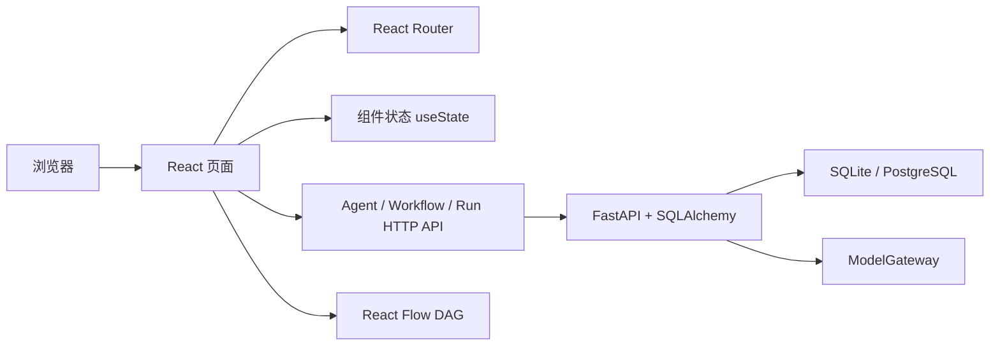

# ARC.ONE 当前版本实现说明

> 对应版本：V0.5 真实 Agent 执行闭环
> 更新时间：2026-06-24

## 1. 当前版本是什么

当前版本是 React 单页应用与 FastAPI 服务组成的可运行原型。

Agent 资产页和工作流设计器已经接入 SQLAlchemy。Agent 支持草稿编辑、版本发布、停用和测试运行；工作流支持草稿持久化、DAG 校验、Agent 版本引用、不可变发布和按拓扑顺序运行。

运行实例、节点运行、产出物和人工审核任务已持久化，运行中心与人工审核页已切换到真实 API。模型调用通过可注入的 OpenAI-compatible ModelGateway 完成；自动化测试使用 FakeGateway，不依赖外部网络。

当前已使用 DeepSeek OpenAI-compatible API 完成真实成功调用验证：Base URL 为 `https://api.deepseek.com`，模型为 `deepseek-v4-pro`。真实 API Key 仅保存在被 Git 忽略的本地 `apps/api/.env` 中。模型单价环境变量尚未配置，因此运行中心的成本暂显示为 `$0.000000`，Token 统计不受影响。

API Key 不进入前端、数据库、仓库和运行响应。



Agent、工作流、运行记录和人工审核数据通过本机 `/api` 发送到 FastAPI，并保存到默认 SQLite 文件 `apps/api/data/arc_one.db`。刷新页面或重启 API 后会重新读取持久化记录。

## 2. 启动链路

### 2.1 HTML 入口

文件：`index.html`

作用：

- 定义中文页面语言。
- 设置移动端 viewport。
- 设置页面标题和描述。
- 挂载 `#root` 容器。
- 加载 `src/main.tsx`。

### 2.2 React 入口

文件：`src/main.tsx`

作用：

- 引入全局 CSS。
- 创建 React Root。
- 渲染根组件 `App`。
- 使用 `StrictMode` 帮助发现潜在副作用问题。

### 2.3 应用路由

文件：`src/App.tsx`

路由关系：

| URL | 页面组件 |
|---|---|
| `/` | `Dashboard` |
| `/workflows` | `Workflows` |
| `/agents` | `Agents` |
| `/evaluations` | `Evaluations` |
| `/runs` | `Runs` |
| `/reviews` | `Reviews` |

`Layout` 作为共同外壳，负责侧栏、顶部栏和页面内容区域。

## 3. 应用外壳

文件：`src/components/Layout.tsx`

实现内容：

- 左侧主导航。
- 当前路由高亮。
- 人工审核数量角标。
- Workspace 展示。
- 顶部页面名称。
- 全局搜索输入框外观。
- 通知按钮。
- 生产环境状态展示。
- 使用 React Router 的 `Outlet` 渲染当前页面。

当前限制：

- 全局搜索只有界面，没有搜索逻辑。
- 通知按钮没有通知中心。
- Workspace 不能切换。
- “生产环境”只是展示文本。

## 4. 数据模型

文件：`src/types.ts`

当前定义四类 TypeScript 接口：

### Agent

包含：

- 名称和角色。
- 负责人。
- 模型和版本。
- 在线状态。
- 质量通过率。
- 运行次数。
- 工具列表。

### Rubric

包含：

- 适用产出物。
- 评分维度。
- 维度权重。
- 硬性门禁。
- 自动通过分数。
- 版本。

### WorkflowRun

包含：

- 工作流名称。
- 运行状态。
- 进度。
- 启动时间和耗时。
- 得分和成本。
- 当前节点。

### ReviewTask

包含：

- 审核标题。
- 所属工作流和节点。
- 风险等级。
- AI 评分。
- 审核人和截止时间。
- 需要人工判断的原因。

这些接口只是前端模型，后续需要由 `packages/contracts` 中的正式 Schema 或 OpenAPI 生成类型替代。

## 5. 演示数据

文件：`src/data/mock.ts`

当前文件仍提供历史演示数组：

- 5 个 Agent。
- 3 套 Rubric。
- 5 条运行实例。
- 3 条人工审核任务。
- 6 项运营指标。

Agent、工作流、运行中心和人工审核页面不再读取其中的 Agent、Run 与 Review 数组，已改用真实 FastAPI。评估中心和运营总览仍使用 Rubric 与运营指标演示数据。

## 6. 工作流 DAG

### 6.1 页面

文件：`src/pages/Workflows.tsx`

采用：

- `@xyflow/react`
- `useNodesState`
- `useEdgesState`
- `addEdge`
- `ReactFlow`
- `Background`
- `Controls`
- `MiniMap`

### 6.2 当前节点

画布初始化 9 个节点：

1. 定时触发。
2. 收集用户反馈。
3. 需求信号提取。
4. 竞品并行研究。
5. 质量门禁。
6. 判断分数。
7. 产品定义。
8. 人工快速审核。
9. 流程完成。

### 6.3 自定义节点

文件：`src/components/WorkflowNode.tsx`

节点支持以下类型：

- Trigger。
- Agent。
- Data。
- Gate。
- Human。
- Branch。
- End。

每种节点使用不同图标和状态颜色。节点左右使用 React Flow Handle 作为连接端点。

### 6.4 已实现交互

- 节点拖动。
- 画布缩放和平移。
- 节点间连线。
- 小地图。
- 点击节点打开配置面板。
- 修改节点名称。
- 保存提示。

### 6.5 尚未实现

- 从左侧节点库拖拽进入画布；当前为点击添加。
- 复制、框选和分组节点。
- 撤销和重做。
- 多选和分组。
- 输入输出变量连线。
- 完整节点参数 Schema 编辑器。
- 循环、并行汇聚和子流程。
- 失败后的断点恢复。
- 并行节点、汇聚和条件路由执行。

当前工作流数据链路：

```text
React Flow 节点/连线
→ 平台 Workflow Contract
→ FastAPI + SQLAlchemy 草稿
→ DAG 与 Agent 版本引用校验
→ WorkflowVersion 不可变快照
```

## 7. Agent 资产页

文件：`src/pages/Agents.tsx`

实现：

- 展示 Agent 状态、模型、版本和负责人。
- 展示质量通过率和运行次数。
- 展示工具标签。
- 使用 `useState` 保存搜索词。
- 使用 `useMemo` 过滤 Agent。
- 通过 `GET /api/agents` 加载持久化 Agent。
- 通过弹窗填写名称、职责、负责人和模型。
- 提交前显示字段级校验错误。
- 通过 `POST /api/agents` 创建 Agent。
- 显示加载、空数据、重试和服务端错误状态。
- 创建成功后立即更新列表，刷新后重新读取数据库。
- 点击 Agent 名称进入详情页。
- 编辑名称、职责、负责人、模型和 System Prompt。
- 配置 Tools 与 Skills。
- 发布不可变 AgentVersion。
- 查看版本历史。
- 停用 Agent，并阻止继续编辑或发布。
- 运行已发布 Agent 版本。
- 展示运行状态、产出、Token、得分和耗时。

未实现：

- 模型参数。
- Tool/Skill 的独立资产库和权限契约。
- Agent 版本比较和回滚。
- 聚合后的真实运行统计。

## 8. 评估中心

文件：`src/pages/Evaluations.tsx`

实现：

- Rubric 卡片。
- 评分维度和权重。
- 硬性门禁。
- 自动流转阈值。
- Golden Set 和回归测试概览外观。

未实现：

- Rubric 编辑器。
- 评价器执行。
- LLM-as-a-Judge。
- Golden Set 管理。
- 回归测试任务。
- 评价一致性校准。

## 9. 运行中心

文件：`src/pages/Runs.tsx`

实现：

- 运行实例列表。
- 点击切换当前实例。
- 状态和进度。
- 总耗时、得分和成本。
- 节点执行时间线。
- 最终产出、模型、Token 和节点重试次数。
- 从 FastAPI 读取持久化 Run 与 NodeRun。

运行实例选择逻辑：

```text
点击运行实例
→ setSelectedId
→ 从 API 返回的 Run 列表寻找对应对象
→ 右侧详情重新渲染
```

未实现：

- WebSocket/SSE 实时推送。
- 日志查询。
- 真实暂停、终止和重跑。
- Trace。
- 运行回放。

## 10. 人工审核

文件：`src/pages/Reviews.tsx`

实现：

- 审核队列。
- Agent 产出预览。
- 质量门禁原因。
- 通过和驳回按钮。
- 操作完成 Toast。
- 审核决策与关联 Run 状态持久化。

未实现：

- 审核任务认领。
- 审核角色分配。
- SLA。
- 会签。
- 工作流暂停和恢复。
- 审核意见持久化。
- 退回重跑。
- 人工修改进入评估集。

## 11. 运营总览

文件：`src/pages/Dashboard.tsx`

实现：

- 六项运营指标。
- 自动完成率柱状图。
- 异常和人工任务摘要。
- 最近运行表格。

柱状图是 CSS 高度图，不是图表库生成。

后续建议改用 Apache ECharts，并从运营指标 API 读取数据。

## 12. 样式系统

文件：`src/index.css`

当前采用单文件原生 CSS，包含：

- 颜色变量。
- 字体变量。
- 布局。
- 导航。
- 表格。
- 卡片和面板。
- 状态徽标。
- React Flow 节点。
- 移动端媒体查询。

当前设计方向：

- 平衡触感 Soft UI。
- 雾蓝灰同材质背景。
- 浅色悬浮图标导航。
- 面板使用克制的外凸阴影。
- 输入框、选中导航和按下状态使用内凹阴影。
- 雾蓝表示主操作、选中和运行状态。
- 珊瑚表示人工介入、风险和失败。
- 表格保留高信息密度和轻分隔线。
- 工作流节点采用统一纯材质，不使用类型色边。

当前 CSS 适合原型。进入多人开发后建议拆成：

```text
styles/
├─ tokens.css
├─ reset.css
├─ layout.css
└─ components/
```

也可以引入 CSS Modules，但不建议为了技术统一直接重写现有样式。

## 13. 当前状态管理

没有引入 Redux、Zustand 或 TanStack Query。

当前只使用 React 内置状态：

- `useState`。
- `useMemo`。
- React Flow 的节点和边状态 Hook。

这是有意为原型控制复杂度。

进入后端阶段后建议：

```text
服务器数据：TanStack Query
画布编辑状态：Zustand
表单状态：React Hook Form
Schema 校验：Zod
```

## 14. 当前构建和质量检查

### 开发

```powershell
npm run dev
```

### 静态检查

```powershell
npm run lint
```

使用 Oxlint。

### 生产构建

```powershell
npm run build
```

执行：

```text
TypeScript 编译检查
→ Vite 生产打包
```

当前自动化测试包括：

- Vitest + Testing Library：API 客户端、创建弹窗、Agent 列表、Agent 详情和工作流契约适配器。
- Pytest：字段校验、Agent 生命周期、工作流 DAG 校验和不可变版本快照。
- Playwright：Agent 创建重载，以及 Agent 发布后被工作流引用和发布的跨模块链路。

## 15. 当前依赖

生产依赖：

- React。
- React DOM。
- React Router DOM。
- React Flow。
- Lucide React。

开发依赖：

- TypeScript。
- Vite。
- Vite React 插件。
- React/Node 类型定义。
- Oxlint。

当前没有：

- UI 组件框架。
- 图表库。
- 第三方 HTTP 客户端，当前使用原生 `fetch`。
- 状态管理库。
- AI SDK。

后端新增：

- FastAPI。
- Pydantic。
- SQLAlchemy。
- SQLite，支持通过 `DATABASE_URL` 切换 PostgreSQL。

## 16. 当前版本验证记录

已经完成：

- TypeScript 类型检查。
- Oxlint。
- Vite 生产构建。
- 桌面端浏览器检查。
- 375px 移动端检查。
- DAG 画布渲染检查。
- 节点名称修改检查。
- 保存 Toast 检查。
- 浏览器控制台错误检查。
- Soft UI 六个路由的桌面端检查。
- `1280×720` 和 `1440×900` 桌面视口检查。
- `390×844` 移动端总览和人工审核检查。
- Agent 搜索过滤回归检查。
- Soft UI 工作流节点改名和保存回归检查。
- 前端 7 项自动化测试通过。
- 后端 3 项 API/持久化测试通过。
- Playwright 创建并刷新重载测试通过。
- 真实 API 进程重启后按稳定 ID 重新读取 Agent。
- Agent 创建弹窗桌面端与 `390×844` 移动端视觉检查。
- Agent 页面移动端无外层横向溢出。
- Agent 草稿编辑、发布版本、历史版本和停用路径通过。
- 工作流创建、保存、Agent 版本引用、发布和刷新恢复通过。
- 工作流发布能拒绝有向环和不存在的 Agent 版本。
- 工作流设计器 `390×844` 移动端工具栏无溢出。

验证时没有发现浏览器控制台错误。

当前机器未安装 Docker，因此 PostgreSQL Compose 配置尚未进行容器运行验证。

## 17. 下一步代码改造

建议按以下顺序改造当前代码：

1. 使用确认后的模型供应商 Base URL 与模型名完成真实成功路径联调。
2. 增加工作流输入输出映射、并行汇聚、条件路由和子流程契约。
3. 增加异步执行、暂停、终止、断点恢复和实时事件推送。
4. 将可配置 Rubric、Golden Set 与评价器接入真实 API。
5. 增加审核意见、认领、SLA、退回重跑和评估样本沉淀。
6. 在具备 Docker 的环境验证 PostgreSQL Compose，并评估 Temporal 或 LangGraph。

完整版本路线和开源工具说明见：

[项目建设蓝图](PROJECT_MASTER_PLAN.md)
