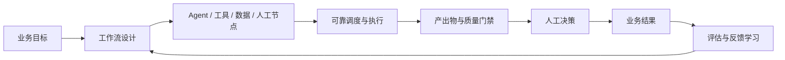
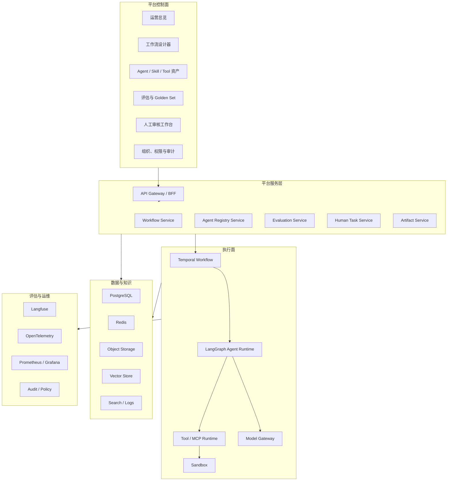

# ARC.ONE Agentic OS 项目建设蓝图

> 文档状态：初版  
> 更新时间：2026-06-24  
> 适用读者：产品负责人、业务架构师、AI 建设者、后端/前端工程师、数据与平台工程师、测试与运维人员

## 1. 文档目的

本文解释 ARC.ONE 从当前交互原型到企业生产平台的完整建设路径，回答以下问题：

1. 当前版本到底实现了什么，哪些只是模拟效果。
2. 整个平台需要哪些系统、服务和数据对象。
3. 每一阶段使用哪些技术栈和开源工具。
4. 从 V0 原型到 V1.0 生产版，再到 V2.0 智能优化平台，应如何逐步落地。
5. 每个版本相对上一版解决什么问题、交付什么成果、如何验收。

本文是项目总纲。后续详细 PRD、架构设计、API 契约、数据库设计和部署手册，应从本文继续拆分。

---

## 2. 一句话定位

ARC.ONE 不是单纯的 Agent 搭建工具，而是：

> 面向企业 AI 工作流设计、执行、评估、人工协作、运行治理和持续优化的 Agentic Workflow Operating System。

平台完整闭环：



---

## 3. 当前版本真实状态

### 3.1 当前已经完成

当前仓库已经从前端原型进入资产持久化阶段，已实现：

- 企业控制台式应用外壳和响应式导航。
- 运营总览页面。
- Agent 资产管理页面。
- Rubric 与质量门禁展示页面。
- 运行实例列表与节点时间线页面。
- 人工审核队列和审核动作页面。
- 基于 React Flow 的 DAG 工作流画布。
- 节点拖动、画布缩放、节点连线。
- 节点选择和右侧配置面板。
- 节点名称即时修改。
- 保存、审核等操作的前端反馈。
- 桌面端和移动端布局。
- TypeScript 类型检查、Lint 和生产构建。
- FastAPI、SQLAlchemy 与 SQLite 持久化。
- Agent 草稿编辑、不可变版本发布、历史版本和停用。
- 工作流草稿保存、DAG 校验、Agent 版本引用和不可变发布。
- 前端、API 和浏览器自动化测试。

### 3.2 当前没有完成

以下能力目前尚未实现：

- 没有用户登录、组织和权限。
- 没有调用任何真实大模型。
- 没有真实 Agent 执行引擎。
- 没有真实工具、Skill、MCP 或企业系统连接。
- 没有工作流真实运行调度。
- 没有真实质量评分、LLM Judge 或 Golden Set。
- 没有真实人工任务流转。
- 没有成本计算、Token 统计和链路追踪。
- 没有 Docker、Kubernetes、CI/CD 和生产监控。

Agent 与工作流来自真实 API；其他页面数据仍来自：

```text
src/data/mock.ts
```

因此当前版本的正确定位是：

> 用于验证产品信息架构、核心对象、关键页面和交互方向的高保真前端原型。

---

## 4. 当前技术栈

### 4.1 已采用技术

| 层级 | 技术 | 当前作用 |
|---|---|---|
| 前端框架 | React 19 | 构建页面和交互组件 |
| 开发语言 | TypeScript 6 | 类型约束和工程安全 |
| 构建工具 | Vite 8 | 本地开发、热更新和生产构建 |
| 路由 | React Router 7 | 六个一级页面路由 |
| DAG 画布 | `@xyflow/react` 12 | 工作流节点、连线、缩放和小地图 |
| 图标 | Lucide React | 导航、按钮和节点图标 |
| 样式 | 原生 CSS | 设计变量、布局、状态和响应式设计 |
| 静态检查 | Oxlint | JavaScript/TypeScript 代码检查 |
| 包管理 | npm | 依赖安装和脚本执行 |
| 版本管理 | Git | 仓库已经初始化，尚未创建首个提交 |

### 4.2 当前目录结构

```text
ARC.ONE/
├─ docs/
│  └─ PROJECT_MASTER_PLAN.md
├─ public/
├─ src/
│  ├─ components/
│  │  ├─ Layout.tsx
│  │  ├─ StatusBadge.tsx
│  │  └─ WorkflowNode.tsx
│  ├─ data/
│  │  └─ mock.ts
│  ├─ pages/
│  │  ├─ Dashboard.tsx
│  │  ├─ Workflows.tsx
│  │  ├─ Agents.tsx
│  │  ├─ Evaluations.tsx
│  │  ├─ Runs.tsx
│  │  └─ Reviews.tsx
│  ├─ App.tsx
│  ├─ index.css
│  ├─ main.tsx
│  └─ types.ts
├─ package.json
├─ tsconfig.json
└─ vite.config.ts
```

### 4.3 当前页面与代码对应关系

| 页面 | 文件 | 当前实现 |
|---|---|---|
| 运营总览 | `src/pages/Dashboard.tsx` | 指标、趋势、异常、最近运行 |
| 工作流编排 | `src/pages/Workflows.tsx` | DAG 画布、节点库、节点配置 |
| Agent 资产 | `src/pages/Agents.tsx` | Agent 搜索、状态、版本、质量表现 |
| 评估中心 | `src/pages/Evaluations.tsx` | Rubric、维度权重、门禁条件 |
| 运行中心 | `src/pages/Runs.tsx` | 运行实例、进度、节点时间线 |
| 人工审核 | `src/pages/Reviews.tsx` | 审核队列、证据、扣分项、审核动作 |

---

## 5. 目标系统总体架构

### 5.1 架构原则

1. **控制面和执行面分离**：平台配置故障不能直接拖垮正在运行的任务。
2. **Agent 与工作流分离**：Agent 是可复用能力，工作流是能力编排。
3. **执行与评价分离**：执行 Agent 不能给自己最终评分。
4. **配置与版本分离**：已发布版本不可被直接覆盖。
5. **自然语言与结构化对象并存**：关键节点通过 Schema 化数据对象交接。
6. **人是正式节点**：人工审核不是异常补丁，而是可配置流程能力。
7. **全链路可追溯**：模型、Prompt、工具、知识、输入输出和人工修改均可回放。
8. **先单业务闭环，再平台化扩张**。

### 5.2 逻辑架构



### 5.3 控制面

控制面负责“定义和管理”：

- 工作流设计与版本。
- Agent、Prompt、Skill、Tool 和知识资产。
- Rubric、门禁和评估集。
- 组织、用户、角色和权限。
- 发布、灰度、回滚和环境管理。
- 运行查询、告警和运营分析。

### 5.4 执行面

执行面负责“实际运行”：

- 接收定时、事件、API 和人工触发。
- 创建运行实例和状态机。
- 调用 Agent、工具、数据源和模型。
- 管理并行、等待、超时、重试和补偿。
- 暂停并创建人工任务。
- 保存节点输入、输出和产出物。
- 触发评价、门禁和后续路由。

---

## 6. 核心领域对象

平台正式开发前，优先统一以下对象。

| 对象 | 含义 | 关键字段 |
|---|---|---|
| Scenario | 业务场景 | 名称、业务目标、负责人、成功指标 |
| Workflow | 工作流定义 | DAG、触发器、变量、版本、环境 |
| WorkflowVersion | 工作流不可变版本 | 节点快照、依赖快照、发布状态 |
| Node | 流程节点 | 类型、输入、输出、超时、重试、路由 |
| Agent | 可复用智能能力 | 指令、模型、工具、知识、版本 |
| PromptVersion | Prompt 版本 | System Prompt、变量、变更说明 |
| Skill | 可组合业务技能 | 输入 Schema、输出 Schema、执行器 |
| Tool | 外部工具 | 接口、鉴权方式、权限、限流 |
| DataObject | 标准数据对象 | JSON Schema、字段、版本、敏感级别 |
| Artifact | 节点产出物 | 内容、来源、版本、血缘、质量状态 |
| Rubric | 评分量规 | 维度、权重、评分锚点、阈值 |
| QualityGate | 质量门禁 | 硬规则、阻断动作、重试策略 |
| GoldenSample | 黄金样本 | 输入、期望输出、专家标签 |
| Evaluation | 评价记录 | 评价器、得分、原因、证据 |
| Run | 工作流运行实例 | 状态、版本、触发来源、成本 |
| NodeRun | 节点运行实例 | 输入输出、耗时、模型、Token、错误 |
| HumanTask | 人工任务 | 审核人、SLA、决策、意见 |
| Feedback | 人工或业务反馈 | 修改差异、标签、是否进入评估集 |
| BusinessMetric | 业务指标 | 口径、目标值、数据来源、周期 |

### 6.1 节点契约

每一个节点必须具有明确契约：

```yaml
node:
  id: competitor-research
  type: agent
  input_schema: OpportunityObject.v1
  output_schema: CompetitorMatrix.v2
  executor: competitor-research-agent@1.8.0
  timeout: 15m
  retry:
    max_attempts: 2
    backoff: exponential
  quality_gate: competitor-analysis-gate@2.1
  routing:
    score_gte_85: next
    score_70_to_84: human_review
    score_lt_70: retry
    hard_gate_failed: blocked
```

### 6.2 产出物契约

Agent 之间优先传递结构化产出物，而不是无约束聊天：

```json
{
  "artifactType": "CompetitorMatrix",
  "schemaVersion": "2.0",
  "workflowRunId": "run_xxx",
  "sourceNodeRunId": "node_run_xxx",
  "data": {},
  "citations": [],
  "quality": {
    "gatePassed": true,
    "score": 89
  }
}
```

---

## 7. 建议技术栈

以下分为“建议基线”和“备选方案”。正式采用前需要做许可证、安全和性能验证。

### 7.1 前端

| 能力 | 建议基线 | 说明 |
|---|---|---|
| Web 框架 | React + TypeScript | 延续当前实现 |
| 构建工具 | Vite | 延续当前实现 |
| 工作流画布 | React Flow | 延续当前实现 |
| 路由 | React Router | 延续当前实现 |
| 服务端状态 | TanStack Query | API 缓存、重试和失效管理 |
| 本地复杂状态 | Zustand | 画布编辑、临时配置和 UI 状态 |
| 表单 | React Hook Form + Zod | Schema 化表单和校验 |
| 组件底层 | Radix UI | 无障碍交互基础，不强制套用视觉主题 |
| 数据表格 | TanStack Table | Agent、运行、审核等高密度表格 |
| 代码编辑器 | Monaco Editor | Prompt、JSON Schema、脚本编辑 |
| 图表 | Apache ECharts | 运营指标、成本、质量趋势 |
| 单元测试 | Vitest + Testing Library | 组件和业务逻辑测试 |
| 端到端测试 | Playwright | 编排、发布、审核等核心流程 |

### 7.2 后端平台

| 能力 | 建议基线 | 说明 |
|---|---|---|
| API 框架 | FastAPI | Python AI 生态成熟、支持异步与类型 Schema |
| 数据模型 | Pydantic | API、节点输入输出和配置校验 |
| ORM | SQLAlchemy 2 | PostgreSQL 数据访问 |
| 数据迁移 | Alembic | 数据库版本迁移 |
| API 契约 | OpenAPI | 自动生成接口文档和前端类型 |
| 实时状态 | WebSocket / SSE | 推送运行进度、日志和人工任务状态 |
| 后台任务 | Temporal Worker | 长流程和可靠执行 |

备选：

- NestJS：团队以 TypeScript 后端为主时可采用。
- Go：适合后期高吞吐网关和运行代理，不建议第一版全栈使用。

### 7.3 工作流与 Agent 执行

| 层级 | 建议工具 | 职责 |
|---|---|---|
| 可靠流程编排 | Temporal | 状态持久化、重试、暂停、恢复、定时器和人工等待 |
| Agent 状态图 | LangGraph | Agent 内部推理、多 Agent 协作、Checkpoint |
| 模型统一网关 | LiteLLM | 多模型统一接口、路由、预算和故障切换 |
| 工具协议 | MCP | 标准化 Agent 与工具/数据连接 |
| 跨系统自动化 | n8n 或自建连接器 | 飞书、邮件、Webhook 和 SaaS 集成 |
| 代码沙箱 | Docker/Kubernetes Job；后续评估 E2B | 隔离执行代码和高风险工具 |

推荐职责边界：

```text
Temporal：整条业务流程是否可靠完成
LangGraph：某个 Agent 节点内部如何思考和协作
LiteLLM：具体调用哪个模型、花了多少钱
MCP：Agent 如何调用企业工具
```

不建议使用 LangGraph 单独承担所有企业级调度职责，也不建议让 Temporal 直接承载复杂 Prompt 和 Agent 推理逻辑。

### 7.4 数据和存储

| 数据类型 | 建议工具 | 存储内容 |
|---|---|---|
| 核心交易数据 | PostgreSQL | 工作流、版本、Agent、运行、审核、评价 |
| 缓存与短状态 | Redis | Session、限流、短期缓存、事件通知 |
| 大文件与产出物 | MinIO / S3 | 报告、附件、模型输入输出、运行归档 |
| 向量检索 | pgvector 起步 | 企业知识向量、评估样本向量 |
| 大规模向量 | Qdrant 备选 | 数据量和检索复杂度上升后使用 |
| 文本与日志检索 | OpenSearch 备选 | 大规模运行日志、审计和全文搜索 |
| 消息事件 | NATS JetStream 起步；Kafka 备选 | 运行事件、异步通知、系统解耦 |

第一阶段不建议同时引入太多数据库。推荐：

```text
PostgreSQL + Redis + MinIO
```

在真实容量证明需要后，再增加 Qdrant、OpenSearch 和 Kafka。

### 7.5 评估与观测

| 能力 | 建议工具 | 作用 |
|---|---|---|
| LLM Trace 与评估 | Langfuse | Prompt、模型调用、Token、成本、数据集和评分 |
| 通用链路标准 | OpenTelemetry | API、Worker、工具和模型统一 Trace |
| 指标 | Prometheus | 成功率、耗时、队列、错误和资源指标 |
| 可视化 | Grafana | 技术运行看板与告警 |
| 日志 | Loki | 应用和 Worker 日志 |
| Trace 后端 | Tempo | 分布式链路追踪 |
| Prompt 回归 | promptfoo | Prompt 与模型组合回归测试 |
| RAG 评估 | Ragas | 检索质量和回答质量测试 |
| LLM 评估框架 | DeepEval 备选 | 自定义指标和测试集运行 |

平台自己的 Evaluation Service 负责业务语义，Langfuse 等工具负责记录、运行和分析，二者不能完全互相替代。

### 7.6 安全与企业治理

| 能力 | 建议工具 |
|---|---|
| 身份认证 | Keycloak 或企业现有 IAM/SSO |
| API 网关 | Kong、Traefik 或云厂商网关 |
| 密钥管理 | HashiCorp Vault 或云 KMS |
| 策略控制 | Open Policy Agent |
| 容器镜像扫描 | Trivy |
| 软件物料清单 | Syft |
| 运行时策略 | Kubernetes NetworkPolicy、Pod Security |
| 审计 | 平台审计表 + OpenTelemetry + 对象存储归档 |

### 7.7 部署与工程

| 阶段 | 建议工具 |
|---|---|
| 本地开发 | Docker Compose |
| 代码仓库 | GitHub / 企业 GitLab |
| CI | GitHub Actions / GitLab CI |
| 容器 | Docker |
| 生产编排 | Kubernetes |
| 包管理 | Helm |
| GitOps | Argo CD |
| 基础设施即代码 | Terraform |
| 错误跟踪 | Sentry，可选 |

---

## 8. 可借鉴的开源项目

这些项目用于拆解和借鉴，不代表全部要成为 ARC.ONE 的直接依赖。

| 项目 | 重点借鉴 | 不应直接照搬的部分 |
|---|---|---|
| Dify | 产品信息架构、工作流编辑、应用发布 | 复杂企业流程、强人工协作和产出物治理较弱 |
| Coze Studio | Agent、Workflow、插件和知识资产 | 需要重新适配企业领域对象和治理要求 |
| Coze Loop | Prompt、评估、Trace 和测试集 | 不能替代 ARC.ONE 自身业务质量模型 |
| Flowise | Agentflow 节点、组件扩展、HITL | 企业权限、业务对象和运营治理不足 |
| Langflow | 可视化组件和开发者体验 | 偏开发工具，不是完整企业操作系统 |
| FastGPT | 中文场景、知识库和流程搭建 | 平台治理和复杂调度仍需扩展 |
| RAGFlow | 文档解析、RAG 和知识底座 | 不负责完整业务流程治理 |
| LangGraph | Agent 状态机、多 Agent 和人工中断 | 不是平台控制面和通用调度系统 |
| Temporal | 可靠流程、恢复、重试和长事务 | 不负责 Agent Prompt、知识和评价 |
| Kestra | 调度 UI、任务历史和事件驱动 | Agent 语义和人工质量闭环需自建 |
| Langfuse | LLM Trace、成本、Prompt 和评估 | 不是业务工作流主数据库 |
| n8n | 连接器、Webhook 和业务自动化 | 许可证和平台化使用边界需单独评估 |
| Apache DolphinScheduler | DAG 调度页面和任务运维体验 | 面向数据任务，缺少 Agent 生命周期概念 |

### 8.1 建议源码研究顺序

1. Dify：研究产品结构和工作流编辑体验。
2. Coze Studio：研究 Agent、插件和资源组织。
3. Langfuse：研究 Trace、Prompt 和 Evaluation 数据模型。
4. Temporal：研究长流程、恢复、重试和人工等待。
5. LangGraph：研究 Agent 节点内部状态。
6. DolphinScheduler/Kestra：研究调度运维页面。

---

## 9. 功能模块全景

### 9.1 工作流编排中心

- 节点拖拽、连线、复制和分组。
- 条件、并行、循环、聚合、子流程。
- 定时、事件、API、Webhook 和人工触发。
- Agent、Tool、MCP、Data、Code、Gate、Human 节点。
- 超时、重试、退避、降级、补偿和熔断。
- 节点输入输出映射。
- 测试运行和断点调试。
- 版本比较、发布、灰度和回滚。
- 从失败节点恢复。
- 普通、竞速、多方案并行等运行模式。

### 9.2 Agent 构建与资产中心

- Agent 基本信息和负责人。
- System Prompt 和变量。
- 模型、参数和模型路由策略。
- 工具、Skill、MCP 和知识库。
- 输入输出 Schema。
- 记忆策略和上下文策略。
- 成本、Token 和时延预算。
- Rubric、Golden Set 和发布门禁。
- 草稿、测试、灰度、生产和停用状态。
- 依赖关系和影响分析。

### 9.3 数据对象与产出物中心

- JSON Schema 设计和版本。
- 字段说明、示例和必填规则。
- 数据敏感等级。
- 产出物版本和状态。
- 来源引用和证据。
- 上下游血缘。
- 人工修订 Diff。
- 质量评价和审批记录。
- 导出、分享、归档和检索。

### 9.4 评估中心

- 硬性门禁。
- Rubric 维度和权重。
- 评分锚点和扣分原因。
- 规则评价器、代码评价器、LLM Judge 和人工评价。
- Golden Set 和挑战集。
- Prompt/模型/Agent 回归测试。
- 评价器一致性校准。
- 线上抽检和漂移监控。
- 节点级、流程级和业务级评价。

### 9.5 运行与 AgentOps

- 实时运行状态。
- 节点时间线。
- 输入输出和产出物查看。
- 模型、Prompt、知识和工具版本。
- Token、成本、时延和重试。
- Trace、日志和工具调用。
- 暂停、终止、重跑和恢复。
- 故障聚类和根因分析。
- SLA 和告警。

### 9.6 人工协作中心

- 待审核队列。
- 人员、角色和审核组分配。
- SLA、催办和升级。
- 原始输入、Agent 产出、证据和评分对照。
- 通过、驳回、修改、转交和会签。
- 人工修改 Diff。
- 人工反馈自动进入评估样本候选池。

### 9.7 平台治理

- 租户、组织、团队和项目空间。
- RBAC 和数据级权限。
- 环境隔离。
- 密钥和连接管理。
- 模型与工具白名单。
- 预算和配额。
- 审计日志。
- 敏感信息脱敏。
- 内容安全和策略审批。

### 9.8 运营驾驶舱

- 自动完成率。
- 人工接管率。
- 一次通过率。
- 质量得分和漂移。
- 失败率和主要失败节点。
- 平均运行周期。
- 单次运行成本。
- 节省工时。
- 业务成果转化。
- Agent、工作流、团队和场景维度分析。

---

## 10. 从零到生产的版本路线

## V0.0：项目定义与业务试点选择

### 目标

先确定平台为什么建、服务谁、第一条真实链路是什么。

### 主要工作

- 明确平台使命、边界和不做事项。
- 选择一条高价值、可量化、风险可控的业务流程。
- 画出现状流程和目标流程。
- 定义业务对象、参与角色和系统边界。
- 建立第一版成功指标。
- 识别数据源、权限和风险。

### 交付物

- 项目章程。
- 试点场景 PRD。
- AS-IS/TO-BE 流程图。
- 领域对象初稿。
- 指标定义表。
- 风险清单。

### 验收标准

- 业务负责人确认试点价值。
- 流程起点、终点和负责人明确。
- 可以获取最小必要数据。
- 成功指标可被实际采集。

---

## V0.1：高保真前端原型

### 状态

当前仓库已经完成这一阶段的主体。

### 目标

验证平台信息架构、核心页面和角色认知。

### 已完成

- 六个一级模块。
- 工作流 DAG 画布。
- 节点配置面板。
- 运行时间线。
- Rubric 展示。
- 人工审核交互。
- 响应式页面。

### 仍需补充

- 节点从左侧拖入画布。
- 节点删除、复制、框选和撤销。
- 工作流输入输出映射 UI。
- Prompt 和 JSON Schema 编辑器。
- Agent 详情页。
- 空状态、加载状态和错误状态。
- 前端自动化测试。

### 相对 V0.0 的改进

- 抽象概念变成可点击、可讨论的产品。
- 业务和技术可以对平台边界形成共同语言。

### 验收标准

- 目标用户能独立完成一次工作流编排演示。
- 用户能说清 Agent、节点、门禁、运行和审核的关系。
- 收集并关闭关键可用性问题。

---

## V0.2：领域模型与 API 契约

### 目标

把页面背后的对象和状态定义清楚，为后端开发建立稳定合同。

### 技术工作

- 建立领域模型。
- 定义 PostgreSQL 初版表结构。
- 使用 OpenAPI 定义接口。
- 使用 JSON Schema 定义节点输入输出。
- 定义工作流 DAG JSON 格式。
- 定义版本、发布和运行状态机。
- 自动生成前端 API 类型。

### 建议新增服务

```text
apps/web
apps/api
packages/contracts
packages/ui
packages/workflow-schema
```

### 交付物

- 数据库 ER 图。
- OpenAPI 文档。
- Workflow Schema。
- Node Contract Schema。
- Artifact Schema。
- 状态机说明。
- ADR 技术决策记录。

### 相对 V0.1 的改进

- 页面字段不再是临时模拟结构。
- 前后端围绕统一契约并行开发。

### 验收标准

- 所有核心页面字段都能映射到领域对象。
- 工作流 JSON 可通过 Schema 校验。
- API Mock 能替换现有 `mock.ts`。

---

## V0.3：平台后端与持久化

### 目标

让平台资产真正可创建、保存、查询和版本化。

### 建议技术

- FastAPI。
- PostgreSQL。
- SQLAlchemy。
- Alembic。
- Redis。
- MinIO。
- TanStack Query。
- React Hook Form + Zod。

### 功能

- 用户登录和基础 Workspace。
- Agent CRUD 和版本。
- 工作流 CRUD 和草稿保存。
- Rubric CRUD。
- 产出物 Schema CRUD。
- 操作审计。
- 前端接入真实 API。

### 交付物

- API 服务。
- 数据库迁移。
- Docker Compose 本地环境。
- Seed 数据。
- API 单元测试和集成测试。

### 相对 V0.2 的改进

- 数据从浏览器内存进入真实数据库。
- 多个用户可以看到一致的平台资产。

### 验收标准

- 重启服务后数据不丢失。
- 工作流草稿自动保存。
- 每次修改均有操作者和时间记录。
- 核心接口具有权限校验和测试。

---

## V0.4：真实 Agent 执行闭环

### 目标

让一条试点工作流真正调用模型和工具并产生产出物。

### 建议技术

- Temporal。
- LangGraph。
- LiteLLM。
- MCP SDK。
- 企业数据连接器。
- MinIO/S3 产出物存储。

### 功能

- API、定时和人工触发。
- 工作流运行实例。
- Agent 节点执行。
- 工具节点执行。
- 数据节点执行。
- 条件和并行节点。
- 超时与重试。
- 运行日志和节点状态推送。
- 结构化产出物保存。

### 交付物

- Orchestrator Worker。
- Agent Runtime Worker。
- Model Gateway。
- 首批 MCP/Tool 连接器。
- 一条端到端真实业务流程。

### 相对 V0.3 的改进

- 平台从“资产管理器”升级为“真实执行系统”。

### 验收标准

- 试点流程能稳定执行到结束。
- 失败后可以重试或从节点恢复。
- 所有节点输入输出可追溯。
- 模型、Prompt、工具版本被记录。

---

## V0.5：质量评价与门禁

### 目标

让平台不仅能运行，还能判断产出是否合格。

### 建议技术

- Langfuse。
- promptfoo。
- Ragas，适用于 RAG 节点。
- 自建 Evaluation Service。

### 功能

- Rubric 版本化。
- 硬性门禁。
- 规则评价器。
- LLM-as-a-Judge。
- 多评价器组合。
- Golden Set。
- Prompt、模型和 Agent 回归测试。
- 分数路由和自动重跑。
- 评价解释和引用证据。

### 评分执行顺序

```text
Schema 校验
→ 硬性门禁
→ 确定性规则
→ LLM Judge
→ 必要时人工抽检
→ 汇总得分
→ 路由动作
```

### 交付物

- 评估任务执行器。
- Golden Set 数据集。
- 第一套线上 Rubric。
- 回归测试流水线。
- 评分校准报告。

### 相对 V0.4 的改进

- 从“运行成功”提升为“业务质量合格”。

### 验收标准

- AI 评分与专家评分的一致性达到约定目标。
- 门禁失败能正确阻断。
- Agent 或 Prompt 发布前必须通过回归测试。
- 低分样本能够定位到具体维度和证据。

---

## V0.6：人工协作与反馈闭环

### 目标

把需要判断的节点正式交给人，并让人的修改反哺系统。

### 功能

- 人工审核节点。
- 审核人、角色、队列和轮转规则。
- SLA、催办和升级。
- 通过、驳回、修改后继续、退回重跑。
- 多人会签和条件审批。
- 人工修改 Diff。
- 反馈样本候选池。
- 专家确认后进入 Golden Set。

### 建议技术

- Temporal Signal/Update。
- WebSocket/SSE。
- 飞书消息和任务连接器。

### 交付物

- Human Task Service。
- 审核工作台生产版。
- 飞书通知。
- 反馈标注流程。

### 相对 V0.5 的改进

- 人不再通过线下消息临时救火。
- 人的判断成为可统计、可学习的数据。

### 验收标准

- 人工节点可以暂停和恢复工作流。
- 超时任务能自动升级。
- 每个决策都有操作者、理由和变更记录。
- 高质量修改可进入评估集。

---

## V0.7：企业权限、安全与治理

### 目标

让平台可以被多个团队安全使用。

### 建议技术

- Keycloak/企业 SSO。
- OPA。
- Vault/KMS。
- API Gateway。
- Trivy。

### 功能

- 多 Workspace。
- 组织、团队、角色和成员。
- RBAC 和资源级权限。
- 数据源和工具权限。
- 模型白名单。
- Prompt 和知识敏感信息检查。
- 密钥托管。
- 成本预算和配额。
- 完整审计。
- 开发、测试、生产环境隔离。

### 相对 V0.6 的改进

- 从试点工具升级为可被企业治理的平台。

### 验收标准

- 用户只能访问授权资源。
- 密钥不进入数据库明文、日志和前端。
- 敏感操作都有审计。
- 高风险工具必须经过策略审批。

---

## V0.8：全链路可观测与平台运维

### 目标

平台出现慢、贵、错时，能够快速定位原因。

### 建议技术

- OpenTelemetry。
- Prometheus。
- Grafana。
- Loki。
- Tempo。
- Langfuse。

### 功能

- Trace ID 串联 API、Temporal、Agent、模型和工具。
- 节点耗时和队列等待。
- Token 和成本。
- 成功率、重试率和失败率。
- 模型、工具和知识源的故障分析。
- 告警和 SLA。
- 运行回放。
- 业务与技术指标关联。

### 相对 V0.7 的改进

- 从“出问题后看日志”升级为主动运营。

### 验收标准

- 任意运行可在一个 Trace 中完整回放。
- 关键故障在目标时间内告警。
- 可按团队、Agent、工作流和模型统计成本。
- 主要失败原因可以聚类。

---

## V0.9：真实业务试点与效果验证

### 目标

用真实团队和真实业务指标证明平台价值。

### 试点建议

选择一条边界明确的链路，例如：

```text
用户反馈采集
→ 需求信号提取
→ 竞品研究
→ 机会评分
→ 人工确认
→ 产品定义初稿
```

### 需要测量

- 流程总周期。
- 人工工时。
- 自动完成率。
- 人工接管率。
- 一次通过率。
- 质量得分。
- 返工次数。
- 单次运行成本。
- 业务人员满意度。
- 最终业务采纳率。

### 相对 V0.8 的改进

- 从技术可用转向业务有效。

### 验收标准

- 与原流程有可比基线。
- 达成预先定义的效率和质量目标。
- 业务负责人愿意持续使用。
- 形成问题、改进和推广清单。

---

## V1.0：企业生产版

### 目标

形成稳定、安全、可运维的正式产品。

### 必备能力

- 高可用部署。
- 数据备份和恢复。
- 容灾方案。
- 发布、灰度和回滚。
- 工作流从失败点恢复。
- Agent 和 Rubric 发布审批。
- 完整权限和审计。
- 生产告警和 On-call 手册。
- 性能、压力和安全测试。
- 用户手册和管理员手册。

### 建议技术

- Kubernetes。
- Helm。
- Argo CD。
- Terraform。
- PostgreSQL 高可用方案。
- Redis 高可用方案。
- 对象存储生命周期管理。

### 相对 V0.9 的改进

- 从“真实业务试点”升级为“正式生产服务”。

### 验收标准

- 满足约定 SLO。
- 通过安全测试和生产评审。
- 具备备份恢复演练记录。
- 关键流程具有自动化端到端测试。
- 具备故障响应和回滚手册。

---

## V1.5：平台化与资产市场

### 目标

让更多团队能够复用已有能力，而不是重复建设。

### 功能

- Agent 市场。
- Skill 和 MCP 市场。
- 工作流模板市场。
- 数据对象模板。
- Rubric 模板。
- 连接器市场。
- 资产评分、负责人、依赖和使用量。
- 一键复制与二次配置。
- 资产废弃和迁移。

### 改进点

- 从单项目交付转向企业能力复用。
- 建立 AI 资产的供应、消费和治理机制。

### 验收标准

- 新工作流可以复用现有资产完成大部分搭建。
- 重复 Agent 和连接器数量下降。
- 核心资产具有明确 SLA 和负责人。

---

## V2.0：自优化 Agentic Operating System

### 目标

平台基于运行数据主动发现瓶颈并提出优化建议，但重要变更仍由人审批。

### 功能

- Prompt、模型和工具组合自动实验。
- 基于质量、成本和时延的多目标路由。
- 失败模式自动聚类。
- Rubric 漂移检测。
- 评价器偏差检测。
- 自动生成改进候选。
- 低风险优化灰度实验。
- 业务流程瓶颈推荐。
- Agent 能力图谱和依赖影响分析。

### 改进点

- 从“人工运营平台”升级为“数据驱动的持续优化平台”。

### 安全边界

- 不允许系统直接修改生产 Agent。
- 所有优化必须生成候选版本。
- 候选版本必须经过回归测试、灰度和人工审批。
- 高风险节点不得完全自动优化和发布。

---

## 11. 建议实施顺序

不建议按页面模块逐个做完再集成。推荐按一条真实闭环纵向建设：

```text
第 1 步：选定一个试点流程
第 2 步：定义 3-5 个核心数据对象
第 3 步：定义工作流和节点契约
第 4 步：实现资产保存与版本
第 5 步：接入一个模型和两个真实工具
第 6 步：跑通真实工作流
第 7 步：增加一套 Rubric 和门禁
第 8 步：增加一个人工审核节点
第 9 步：打通 Trace、成本和质量数据
第 10 步：试点并测量业务结果
```

第一条链路跑通后，再横向扩展其他页面和能力。

---

## 12. 推荐仓库结构

平台进入全栈开发后，建议采用 Monorepo：

```text
arc-one/
├─ apps/
│  ├─ web/                 # React 控制面
│  ├─ api/                 # FastAPI 平台 API
│  ├─ workflow-worker/     # Temporal 工作流
│  ├─ agent-worker/        # LangGraph Agent Runtime
│  └─ evaluator-worker/    # 评估执行器
├─ packages/
│  ├─ contracts/           # OpenAPI/JSON Schema/生成类型
│  ├─ domain/              # 核心领域模型
│  ├─ workflow-schema/     # DAG 和节点定义
│  ├─ sdk/                 # Tool、Skill、Agent SDK
│  └─ ui/                  # 共享 UI 组件
├─ connectors/
│  ├─ lark/
│  ├─ database/
│  ├─ web-search/
│  └─ internal-api/
├─ evals/
│  ├─ golden-sets/
│  ├─ rubrics/
│  └─ regression/
├─ deploy/
│  ├─ compose/
│  ├─ helm/
│  └─ terraform/
├─ docs/
│  ├─ product/
│  ├─ architecture/
│  ├─ adr/
│  ├─ api/
│  └─ operations/
└─ .github/workflows/
```

---

## 13. 开发流程

### 13.1 每个功能的标准流程

1. 编写业务目标和验收条件。
2. 更新领域对象和契约。
3. 编写数据库迁移。
4. 实现后端 API。
5. 编写后端测试。
6. 实现前端页面。
7. 编写前端组件和端到端测试。
8. 接入 Trace、指标和审计。
9. 进行安全和权限检查。
10. 发布测试环境。
11. 业务验收。
12. 灰度生产。

### 13.2 Definition of Done

一个功能只有满足以下条件才算完成：

- 验收条件通过。
- 类型检查通过。
- Lint 通过。
- 单元和集成测试通过。
- 核心路径 E2E 通过。
- 权限和审计已覆盖。
- 错误和空状态已处理。
- 指标和日志可观测。
- 文档已更新。
- 可以回滚。

---

## 14. 测试策略

### 14.1 前端测试

- 纯函数和状态：Vitest。
- 组件行为：Testing Library。
- DAG 编辑器：节点增加、删除、连线、保存和恢复。
- E2E：创建 Agent、发布工作流、运行、门禁、人工审核。
- 视觉回归：关键页面桌面和移动端截图。

### 14.2 后端测试

- 领域规则单元测试。
- API 权限测试。
- PostgreSQL 集成测试。
- Temporal Workflow Replay 测试。
- Worker 幂等性测试。
- 工具超时、重试和熔断测试。

### 14.3 Agent 与评估测试

- Prompt 单元样本。
- Golden Set 回归。
- 对抗和边界样本。
- Judge 一致性测试。
- 模型升级 A/B 测试。
- 成本和时延基准。
- 人工抽检。

### 14.4 非功能测试

- 并发和压力测试。
- 长时间运行稳定性。
- 网络中断和依赖故障。
- 数据恢复演练。
- 权限穿透测试。
- Prompt Injection 和工具滥用测试。

---

## 15. 关键指标

### 15.1 平台技术指标

- API 可用性。
- 工作流启动成功率。
- 节点执行成功率。
- 平均恢复时间。
- P50/P95/P99 时延。
- Worker 队列长度。
- 数据库和缓存资源。

### 15.2 Agent 质量指标

- 硬门禁通过率。
- Rubric 平均分。
- 一次通过率。
- 人工修改率。
- 幻觉或无依据结论率。
- 评价器与专家一致性。

### 15.3 业务价值指标

- 自动完成率。
- 人工接管率。
- 流程周期缩短。
- 节省工时。
- 返工率。
- 单次运行成本。
- 产出采纳率。
- 最终业务成果。

### 15.4 平台化指标

- 活跃工作流数。
- 活跃 Agent 数。
- 资产复用率。
- 新流程上线周期。
- 连接器复用量。
- 覆盖团队和业务场景。

---

## 16. 主要风险

| 风险 | 表现 | 应对 |
|---|---|---|
| 一开始做得过大 | 模块很多，但没有真实闭环 | 强制围绕一个试点纵向建设 |
| 把拖拽当核心壁垒 | 页面漂亮但结果不可靠 | 优先投资数据对象、评价和观测 |
| Agent 自评 | 分数虚高且不可校准 | 独立 Evaluation Service 和人工抽检 |
| 无版本治理 | Prompt 修改导致线上结果漂移 | 所有资产不可变版本化 |
| 工具权限过大 | Agent 误操作企业系统 | 最小权限、审批、沙箱和审计 |
| 组件过多 | 运维复杂度提前爆炸 | PostgreSQL/Redis/MinIO 起步，按容量扩展 |
| 数据不可追溯 | 结论无法解释 | 强制引用、血缘和产出物契约 |
| 人工反馈丢失 | 同类错误重复发生 | 修改 Diff 进入反馈和评估样本池 |
| 指标只看效率 | 自动化高但业务效果差 | 同时衡量质量和业务结果 |
| 被单一模型绑定 | 成本、能力和供应风险 | LiteLLM/模型网关统一抽象 |

---

## 17. 近期建议

当前最合适的下一阶段不是继续增加更多静态页面，而是进入 V0.2：

1. 选定第一条真实业务链路。
2. 定义 Workflow、Node、Agent、Artifact、Rubric、Run 六个核心对象。
3. 定义工作流 DAG JSON 和节点契约。
4. 设计 PostgreSQL 初版表结构。
5. 定义 OpenAPI。
6. 将 `mock.ts` 替换为可切换的 Mock API。
7. 再进入 FastAPI 与持久化建设。

建议首个技术里程碑：

> 用户能够创建一个 Agent，创建并保存一条工作流，将 Agent 节点放入工作流，发布一个不可变版本，并从数据库重新加载。

这个里程碑暂时不需要调用真实大模型，但会把后续执行需要的地基打牢。

---

## 18. 文档拆分计划

随着项目推进，应从本文拆出以下正式文档：

| 文档 | 何时建立 |
|---|---|
| 试点业务 PRD | V0.0 |
| 领域模型说明 | V0.2 |
| 数据库设计 | V0.2 |
| Workflow/Node Schema | V0.2 |
| API 规范 | V0.2 |
| Agent Runtime 设计 | V0.4 |
| 评估体系设计 | V0.5 |
| 权限与安全模型 | V0.7 |
| 可观测性规范 | V0.8 |
| 部署与运维手册 | V1.0 |
| 用户操作手册 | V1.0 |

---

## 19. 当前版本运行方式

```powershell
npm install
npm run dev
```

质量检查：

```powershell
npm run lint
npm run build
```

当前本地开发地址：

```text
http://127.0.0.1:4173
```

端口被占用时，Vite 可以使用其他端口启动。
