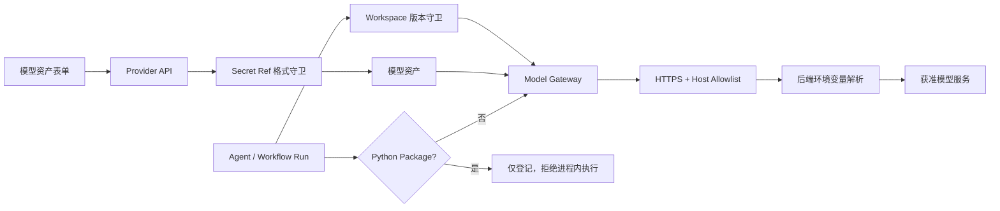

# P0 运行时安全收口设计

## 背景

ARC.ONE 当前已经能从模型资产读取 Secret Ref、调用 OpenAI-compatible 模型，并可按
Agent Runtime Manifest 动态加载 LangChain Python Package。工作流发布和运行也会读取
AgentVersion 快照。这些能力已经跨过原型展示边界，但对应的凭证、代码执行和
Workspace 守卫尚未闭合。

## 方案比较

### 方案 A：立即严格收口（采用）

- 禁止内联 Key，绑定 Provider 必须使用后端环境变量引用。
- 模型出口采用 HTTPS + 精确 Host 允许名单。
- Python Package 只登记，隔离执行器完成前禁止运行。
- 校验与 Runtime 双层执行 Workspace 约束。
- 启动时清理历史无效引用。

优点：立即消除最高风险，不依赖使用者自觉。缺点：已有内联 Key 和 Package Agent 会
停止运行，需要管理员重新配置。

### 方案 B：本地兼容开关

增加 `ALLOW_INLINE_MODEL_KEYS` 和 `ALLOW_IN_PROCESS_PACKAGES`，生产默认关闭，本地可开。

优点：迁移平滑。缺点：危险路径仍长期存在，环境误配即可重新暴露；测试也必须维护
两套安全语义。拒绝。

### 方案 C：只警告不阻断

保留现有行为，仅在 UI 和日志中提示。

优点：没有兼容性影响。缺点：不能阻止凭证外泄、任意代码执行和越界引用。拒绝。

## 已确认决策

用户于 2026-07-10 确认方案 A，并接受当前天气 Agent 等历史配置暂时不可运行，直到
重新绑定后端 Secret Ref 或未来接入隔离执行器。

## 1. 模型凭证契约

### Secret Ref

第一阶段 Secret Ref 仅表示后端环境变量名，格式为：

```text
[A-Z_][A-Z0-9_]*
```

前端仍可显示该“引用标签”，但不得提供“Key”入口。后端在持久化前验证；不符合格式
时返回固定错误文案，不把提交值放入响应或审计记录。

未绑定 Provider 的 Agent 可以继续使用服务端 `MODEL_API_KEY`。一旦 AgentVersion 绑定
了 `modelProviderId`，就必须同时具备合法 `modelSecretRef` 且对应环境变量存在；不得
静默回退到 `MODEL_API_KEY`。

### 模型出口

新增 `MODEL_ALLOWED_HOSTS`，按逗号分隔。最终外呼点必须同时满足：

- Base URL scheme 为 `https`。
- URL 不包含用户名、密码、query 或 fragment。
- `hostname` 与允许名单中的某一项精确相等。
- 允许名单为空或 Host 不匹配时 fail closed。

默认允许 `api.deepseek.com`，保持当前明确使用的模型服务可用；新增其他模型服务必须由
后端运维显式加入允许名单。HTTP 客户端不跟随重定向。

### 历史清理

应用启动后、处理请求前扫描模型 Provider 与 AgentVersion 快照：

- 不符合 Secret Ref 格式的 `model_providers.secret_ref` 置空。
- 不符合格式的 `snapshot.modelSecretRef` 置空。
- 不读取、打印或写入原值到审计/日志。
- 只提交发生变化的记录。

清空后的绑定 Provider 会在运行时返回“模型资产未配置后端密钥引用”，不会回退全局 Key。

## 2. Python Package 执行边界

`runtimeManifest` 中 `runtime=langchain`、`sourceType=python_package` 且存在 `entrypoint`
时，Runtime 不再：

- 读取 `packageSource` 作为本地路径。
- 修改 `sys.path`。
- 调用 `import_module`。
- 实例化 `ChatOpenAI` 或调用 Package 工厂。

Runtime 直接返回失败：

```text
Python Package 当前仅登记元数据，尚未接入隔离执行器
```

尝试次数固定为 1，Token/成本为 0。Package 元数据仍可保存、发布和查看，为后续独立
Worker/容器执行器保留资产契约。

前端 Package 区显示“仅登记”；当前发布版本含 Package 元数据时禁用“运行 Agent”，
避免请求发出后才告知用户。

## 3. Workspace 隔离

所有版本读取采用复合条件：

```text
version.workspace_id == current_workspace_id
AND version.asset_id == requested_asset_id
AND version.version == requested_version
```

具体覆盖：

- `validate_workflow` 校验 AgentVersion。
- `ExecutionService.execute_agent` 读取 AgentVersion。
- 直接 Agent 运行读取 AgentVersion。
- 同步/异步 Workflow 运行读取 WorkflowVersion。
- 从 Run 恢复 WorkflowVersion 快照。

越界引用统一按“不存在”处理，不向调用者暴露其他 Workspace 是否拥有该 ID/版本。

## 4. 数据流



## 5. 错误处理

- Secret Ref 非法：HTTP 422，固定文案，不回显输入。
- Provider 引用为空/环境变量缺失：运行失败，给出可操作但不含变量值的错误。
- Base URL 未获准：运行失败，且 HTTP 客户端调用次数为 0。
- Package 运行：稳定失败，不重试、不执行任何导入。
- 跨 Workspace 版本：校验失败或 Runtime 抛出“不存在”。

## 6. 验证策略

1. 每项行为先修改/新增聚焦测试并确认 RED。
2. 最小实现后确认 GREEN，再跑对应 API 回归。
3. 运行完整后端测试、前端测试、lint、build。
4. 浏览器验证模型资产表单、Package 仅登记提示和禁用状态。
5. 扫描代码确认不存在内联 Key 兼容分支、`sys.path.insert` 和 Package `import_module`。
6. 对抗式复核错误响应、日志与快照不含测试中的伪 Secret 值。

