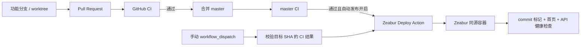

# ARC.ONE Zeabur 单一交付链路设计

> 状态：已确认
> 日期：2026-07-10

## 1. 背景

ARC.ONE 当前公网版本实际运行在 Zeabur 的同源容器中，Zeabur PostgreSQL 保存线上
数据。仓库仍残留 Cloudflare Pages、Render、Zeabur 前后端拆分部署等历史路径，造成
配置和文档互相矛盾。当前本地提交、GitHub `master` 与 Zeabur 线上版本也可能短暂处于
不同 commit，缺少一条强制的发布顺序。

## 2. 第一性原理核查

底层目标不是“支持尽可能多的部署平台”，而是让当前唯一生产原型具备可追溯、可重复、
可验证的交付链路。必要对象和约束只有：

- 一个不可变 Git commit SHA。
- 一次针对该 SHA 的成功 CI 结果。
- 一个接收该源码的 Zeabur 生产服务。
- 不进入仓库和日志的部署凭证。
- 能证明公网已经切换到目标 SHA 的验收信号。

Cloudflare Pages 和 Render 对当前闭环没有贡献，保留它们只增加误配置和误部署风险，
因此应删除而不是继续维护为“备用方案”。

## 3. 目标架构

公网运行结构保持不变：根 Dockerfile 构建 React 静态资源、启动 FastAPI，并由 Nginx
在同一域名提供页面和 `/api/*` 反向代理。`apps/api/Dockerfile` 继续服务 Compose API
与 execution worker，不属于 Render 专用文件。

## 4. 代码与配置收敛

删除：

- Cloudflare Pages GitHub Actions workflow。
- Wrangler Pages 配置。
- Cloudflare 专用 `_headers`、`_redirects`、生成脚本及测试。
- Render Blueprint。

调整：

- 根 Dockerfile 从 Pages 专用构建切换为标准 `npm run build`。
- `package.json` 移除 `build:pages`。
- 部署验证器检查 Zeabur 同源构建、CI 和发布工作流，同时把上述旧文件列为禁止项。
- 部署参数、安全说明和当前实现文档只保留 GitHub + Zeabur + PostgreSQL。

## 5. 自动发布工作流

新增独立的 Zeabur GitHub Actions workflow：

1. `workflow_run` 监听名为 `CI` 的工作流完成事件。
2. 只有来源事件为 `push`、结论为 `success`、分支为 `master` 且变量
   `ZEABUR_AUTO_DEPLOY=true` 时自动运行。
3. `workflow_dispatch` 保留手动触发；目标默认是当前 `master`，也可输入 commit SHA。
4. 自动入口要求目标 SHA 等于当前 `origin/master`，防止晚完成的旧 CI 回滚新版本。
5. 手动触发时通过 GitHub Actions API 确认目标 SHA 存在精确匹配的成功 `master`
   push CI；PR CI 不作为精确 SHA 的发布证据。
6. checkout 当前 `master` 的发布控制代码和独立的目标源码目录；确认目标属于远端
   `master` 历史。
7. 在目标源码的 `public/deployment.json` 临时写入目标 SHA；文件不提交 Git，也不含密钥。
8. 使用固定版本 `0.19.0` 的 Zeabur CLI 与 Token 登录，并以项目、服务、环境 ID
   无交互上传目标源码，避免 `latest` 在未验证时改变发布行为。
9. Token 仅注入上传步骤，并在该步骤退出时注销 CLI；后续脚本无权读取凭证。
10. 轮询公网 `deployment.json`，只有读到目标 SHA 才继续运行首页和 `/api/health` 验收。

## 6. 配置边界

GitHub Secret：

- `ZEABUR_TOKEN`

GitHub Variables：

- `ZEABUR_PROJECT_ID`
- `ZEABUR_SERVICE_ID`
- `ZEABUR_ENVIRONMENT_ID`
- `ZEABUR_PRODUCTION_URL`
- `ZEABUR_AUTO_DEPLOY`

工作流不得打印 Secret，不得读取 Zeabur 数据库密码、管理员密码、模型 Key 或应用 `.env`。
部署平台中的运行环境变量继续由 Zeabur 管理，发布工作流只上传源码。

## 7. 失败处理

- CI 失败：不触发部署。
- 自动发布未开启：不触发部署，可手动执行。
- GitHub 配置缺失：工作流在上传前明确失败，现有线上版本不受影响。
- 生产 URL 不是无路径、无凭证、无查询参数的 HTTPS Origin：上传前失败。
- Zeabur 上传失败：工作流失败，现有线上版本继续运行。
- 新部署构建或启动失败：目标 SHA 标记不会出现，轮询超时并失败。
- 页面或 API 验收失败：工作流失败，并保留 Action 日志供诊断。

不在本切片自动回滚数据库或修改 Zeabur 运行时 Secret。需要回滚时重新部署上一个已通过
CI 的 commit，确保回滚行为仍可追溯。

## 8. 测试与验收

- 先修改部署配置验证器，使它因旧文件存在、新 workflow 缺失而失败。
- 完成删除与新 workflow 后，部署配置验证器必须转绿。
- 运行后端部署和网络安全测试，确认 Nginx、FastAPI 与生产设置不回归。
- 运行全量前端测试、后端测试、lint、生产构建与 `git diff --check`。
- 推送功能分支，等待 PR CI 成功后合并 `master`。
- 配置 GitHub Secret/Variables 后，部署同一 master SHA，并验证公网 commit 标记、首页、
  `/api/health`、登录页及浏览器控制台。

## 9. 对抗式审查

- **错误完成感：** 单纯健康检查可能命中旧版本，因此必须先匹配目标 commit 标记。
- **绕过 CI：** 自动入口只消费当前 master 的成功 push CI；手动入口只接受精确 SHA 的
  成功 master push CI。
- **凭证泄漏：** Token 只使用 GitHub Secret 且只注入上传步骤；步骤结束后注销 CLI。
  提交、Action 输出和公开标记均不包含凭证。
- **部署漂移：** 工作流 checkout 明确 SHA，而不是部署 runner 当时不确定的工作目录。
- **文档夸大：** 当前仍是公网原型，不把单服务自动发布描述为高可用生产系统。
- **并发覆盖：** workflow 使用 production concurrency，同一时刻只允许一个生产发布；后来的
  发布不会静默取消正在进行的发布。

## 10. 范围外

- staging、蓝绿发布、金丝雀发布和自动数据库迁移。
- 自动回滚与数据恢复。
- Zeabur GitHub Integration 直接监听 `master`。
- Cloudflare Pages、Render 及其他云平台兼容层。
